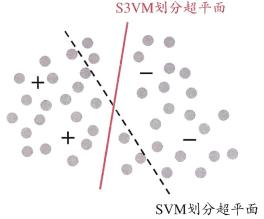
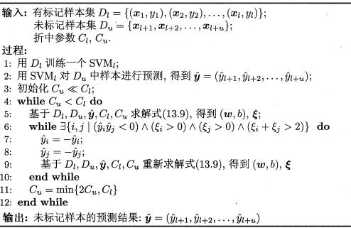
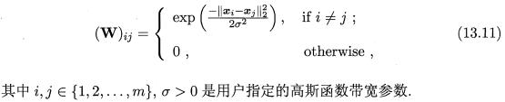
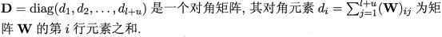
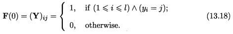
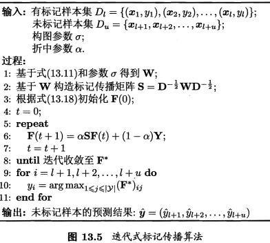
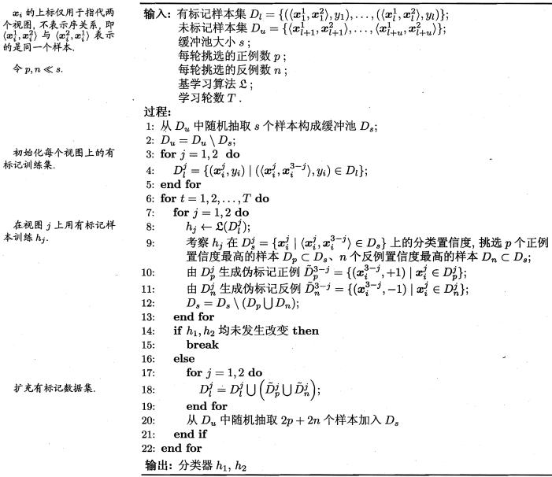
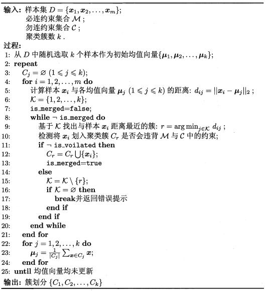

第十三章: 半监督学习

在训练过程中将未标记的数据与少量标记的数据结合使用时，可以显着提高学习准确性

## 生成式方法(13.2)

为什么无标记样本能提高分类模型性能见书本P.296

例子见 [GMM_SSL_EM.py](./GMM_SSL_EM.py)

## 半监督SVM(13.3)

### S3VM

在不考虑未标记样本时,支持向量机试图找到最大间隔划分超平面, 而在考虑未标记样本后, S3VM 试图找到能将两类有标记样本分开, 且穿过数据低密度区域的划分超平面, 如图13.3所示, 这里的基本假设是"低密度分隔" (low-density separation), 显然,这是聚类假设在考虑了线性超平面划分后的推广

代码见此仓库: [semisup-learn](https://github.com/tmadl/semisup-learn)

### TSVM

半监督支持向量机中最著名的是 TSVM(Transductive Support Vector Machine)[Joachims , 1999]. 与标准 SVM一样, TSVM也是针对二分类间题的学习方法. TSVM试图考虑对未标记样本进行各种可能的标记指派(label assignment), 即尝试将每个未标记样本分别作为正例或反例, 然后在所有这些结果中, 寻求一个在所有样本(包括有标记样本和进行了标记指派的未标记样本)上间隔最大化的划分超平面. 一旦划分超平面得以确定, 未标记样本的最终标记指派就是其预测结果

尝试未标记样本的各种标记指派是一个穷举过程, 仅当未标记样本很少时才有可能直接求解

TSVM 采用局部搜索来迭代地寻找近似解. 具体来说,它先利用有标记样本学得一个 SVM, 即忽略式 (13.9) 中关于 C_u 与yhat的项及约束. 然后,利用这个 SVM 对未标记数据进行标记指派 (label assignment). 即将 SVM预测的结果作为"伪标记" (pseudφlabel) 赋予未标记样本, 注意到此时未标记样本的伪标记很可能不准确, 因此C_u要设置为比C_l小的值,使有标记样本所起作用更大.接下来, TSVM 找出两个标记指派为异类且很可能发生错误的未标记样本, 交换它们的标记, 再重新基于式 (13.9) 求解出更新后的划分超平面和松弛向量然后再找出两个标记指派为异类且很可能发生错误的未标记样本, 标记指派调整完成后,逐渐增大 C_u 以提高未标记样本对优化目标的影响,进行下一轮标记指派调整,直至 C_u=C_l 为止. 此时求解得到的 SVM 不仅给未标记样本提供了标记,还能对训练过程中未见的示例进行预测

**我自己试了几次有时候SVM更好, 有时候TSVM更好**

## 图半监督学习(13.4)

基于样本点之间的距离用数学方法求解

优点: 概念清晰

缺点:

1. 存储开销大, 达到O(m^2)

2. 处理新样本难. 要么重新标记传播, 要么在D_l和D_u上训练一个新学习器来预测新样本

## 基于分歧的方法(13.5)

"协同训练"(co-training)是此类方法的代表, 下面主要讲述协同训练

### 视图定义

一个数据对象往往同时拥有多个"属性集" (attribute set) ,每个属性集就构成了一个"视图 "(view). 比如一部电影可以定义两个视图, 一个图像视图, 一个声音视图

### 为什么有效

协同训练正是很好地利用了多视图的"相容互补性". 假设数据拥有两个充分(sufficient)且条件独立视图, "充分"是指每个视图都包含足以产生最优学习器的信息, "条件独立"则是指在给定类别标记条件下两个视图独立

理论证明显示出,若两个视图充分且条件独立,则可利用未标记样本通过协同训练将弱分类器的泛化性能提升到任意高

不过,视图的条件独立性在现实任务中通常很难满足,因此性能提升幅度不会那么大,但研究表明,即使在更弱的条件下, 协同训练仍可有效地提升弱分类器的性能

### 训练过程

可用一个简单的办法来利用未标记数据:首先在每个视图上基于有标记样本分别训练出一个分类器,然后让每个分类器分别去挑选自己"最有把握的"未标记样本赋予伪标记,并将伪标记样本提供给另一个分类器作为新增的有标记样本用于训练更新......

### 变种

后续一些协同训练算法变种无需数据拥有多视图,仅需弱学习器之间具有显著的分歧(或差异)即可. 不同视图、不同算法、不同数据采样、不同参数设置等都仅是产生差异的渠道, 而非必备条件

## 半监督聚类(13.6)

在现实聚类任务中我们往往能获得一些额外的监督信息,于是可通过半监督聚类 (semi-supervised clustering) 来利用监督信息以获得更好的聚类效果

聚类任务中获得的监督信息大致有两种类型.第一种类型是"必连"(must-link)与"勿连"(cannot-link)约束, 前者是指样本必属于同一个簇,后者是指样本必不属于同一个簇;第二种类型的监督信息则是少量的有标记样本

### 约束k均值算法(必连勿连约束)

本质上就是在满足约束的条件下贪心的进行k均值聚类

### 约束种子k均值算法(有少量的有标记样本)

有标记样本中的标记指的是已经知道了某些样本的最终所属簇

这样的监督信息利用起来很容易: 直接将它们作为"种子", 用它们初始化k均值算法的k个聚类中心, 并且在聚类簇迭代更新过程中不改变种子样本的簇隶属关系

