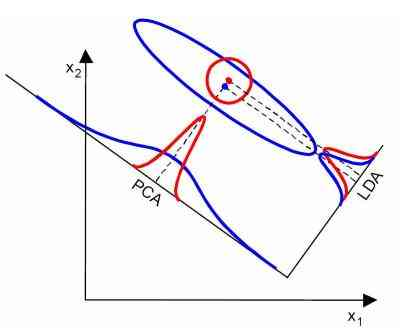
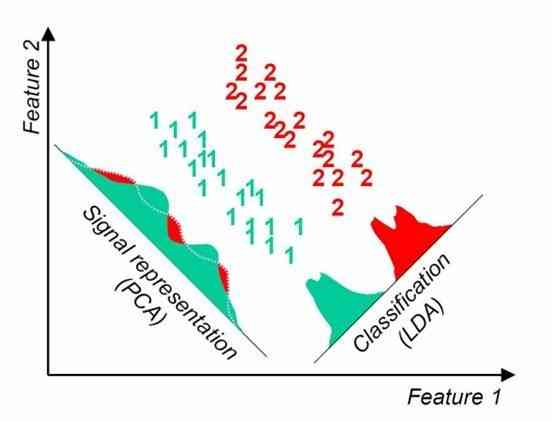

refer: [线性判别分析LDA原理总结](https://www.cnblogs.com/pinard/p/6244265.html), [用scikit-learn进行LDA降维](https://www.cnblogs.com/pinard/p/6249328.html)

## LinearDiscriminantAnalysis类参数概述

1）solver : 即求LDA超平面特征矩阵使用的方法可以选择的方法有奇异值分解"svd"，最小二乘"lsqr"和特征分解"eigen"一般来说特征数非常多的时候推荐使用svd，而特征数不多的时候推荐使用eigen主要注意的是，如果使用svd，则不能指定正则化参数shrinkage进行正则化默认值是svd

2）shrinkage：正则化参数，可以增强LDA分类的泛化能力如果仅仅只是为了降维，则一般可以忽略这个参数默认是None，即不进行正则化可以选择"auto",让算法自己决定是否正则化当然我们也可以选择不同的[0,1]之间的值进行交叉验证调参注意shrinkage只在solver为最小二乘"lsqr"和特征分解"eigen"时有效

3）priors ：类别权重，可以在做分类模型时指定不同类别的权重，进而影响分类模型建立降维时一般不需要关注这个参数

4）n_components：即我们进行LDA降维时降到的维数在降维时需要输入这个参数注意只能为\[1,类别数-1\]范围之间的整数如果我们不是用于降维，则这个值可以用默认的None

## LDA补充

### 为什么W是d*(N-1)?

S_b中每一项秩为1, 相加后最大的秩为N(矩阵的秩小于等于各个相加矩阵的秩的和)

但当我们知道前N-1个μ_i和μ后, μ_N就可以由它们线性表示, 所以S_b的秩最大为N-1, 从而S_w^{-1}S_b的秩最大为N-1

### 优点

1. 在降维过程中可以使用类别的先验知识经验，而像PCA这样的无监督学习则无法使用类别先验知识

2. LDA在样本分类信息依赖均值而不是方差的时候，比PCA之类的算法较优

### 缺点

1. LDA不适合对非高斯分布样本进行降维，PCA也有这个问题

2. LDA降维最多降到类别数k-1的维数，如果我们降维的维度大于k-1，则不能使用LDA当然目前有一些LDA的进化版算法可以绕过这个问题

3. LDA在样本分类信息依赖方差而不是均值的时候，降维效果不好

4. LDA可能过度拟合数据

### 对比PCA

#### 相同点

1. 两者均可以对数据进行降维

2. 两者在降维时均使用了矩阵特征分解的思想

3. ~~两者都假设数据符合高斯分布~~(我感觉这条不太对)

#### 不同点

1. LDA是有监督的降维方法，而PCA是无监督的降维方法

2. LDA降维最多降到类别数k-1的维数，而PCA没有这个限制

3. LDA除了可以用于降维，还可以用于分类

4. LDA选择分类性能最好的投影方向，而PCA选择样本点投影具有最大方差的方向

#### 举例

