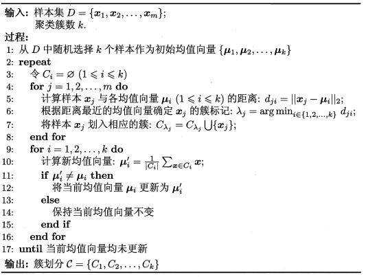
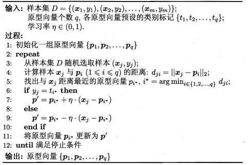
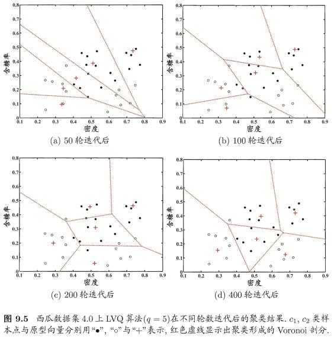
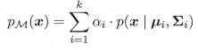
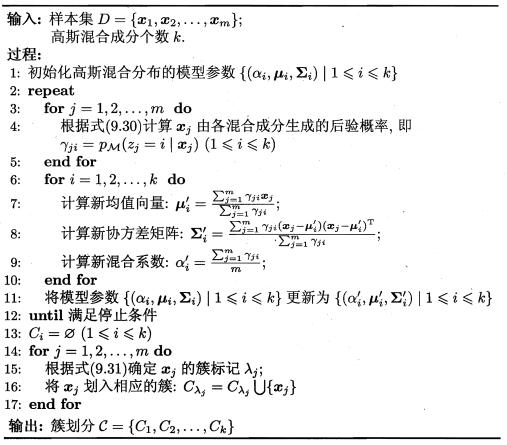
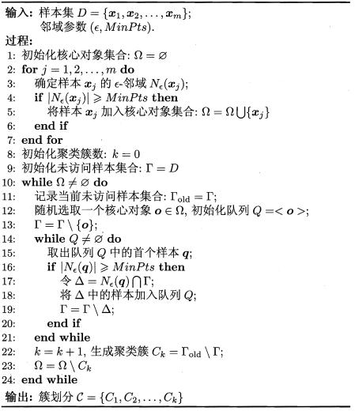
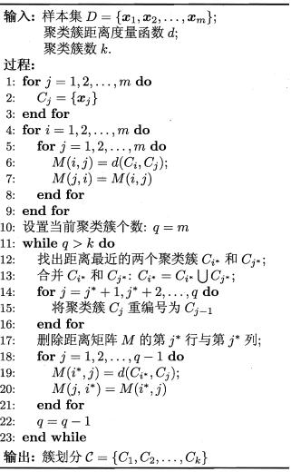

## 原型聚类

### K-Means算法

k-平均聚类的目的是：把n个点划分到k个聚类中，使得每个点都属于离他最近的均值（此即聚类中心）对应的聚类，以之作为聚类的标准。这个问题将归结为一个把数据空间划分为Voronoi cells的问题

### 学习向量量化(LVQ)

与 k 均值算法类似,"学习向量量化" (Learning Vector Quantization,简称 LVQ) 也是试图找到一组原型向量来刻画聚类结构, 但与一般聚类算法不同的是, LVQ 假设数据样本带有类别标记 ,学习过程利用样本的这些监督信息来辅助聚类

可看作通过聚类来形成类别"子类"结构,每个子类对应一个聚类簇

**就是在同一类别标记中的样本里再聚类**

### 高斯混合聚类算法

Σαi = 1

假设样本的生成过程由高斯混合分布给出: 首先, 根据 α1, α2, ..., αk 定义的先验分布选择高斯混合成分 ,其中 αi 为选择第 i 个混合成分的概率;然后,根据被选择的混合成分的概率密度函数进行采样, 从而生成相应的样本.

## 密度聚类

密度聚类亦称"基于密度的聚类" (density-based clustering) ,此类算法假设聚类结构能通过样本分布的紧密程度确定.通常情形下,密度聚类算法从样本密度的角度来考察样本之间的可连接性,并基于可连接样本不断扩展聚类簇以获得最终的聚类结果.

### DBSCAN

DBSCAN 是一种著名的密度聚类算法, 它基于一组"邻域"(neigh-borhood) 参数 (ε, MinPts) 来刻画样本分布的紧密程度

其中N(x)表示x某领域内的样本, 反斜杠表示去除

## 层次聚类

### AGNES

最初将每个对象看成一个簇，然后将这些簇根据某种规则被一步步合并，就这样不断合并直到达到预设的簇类个数

图中有个错误, 第5行的 j 应该从 i+1 开始