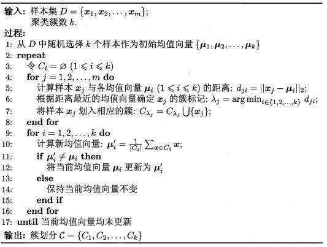

copy from [K-Means聚类算法原理](https://www.cnblogs.com/pinard/p/6164214.html) and [用scikit-learn学习K-Means聚类](https://www.cnblogs.com/pinard/p/6169370.html)

## 用scikit-learn学习K-Means聚类

### K-Means类概述

在scikit-learn中，包括两个K-Means的算法，一个是传统的K-Means算法，对应的类是KMeans。另一个是基于采样的Mini Batch K-Means算法，对应的类是MiniBatchKMeans

用KMeans类的话，一般要注意的仅仅就是k值的选择，即参数n_clusters；如果是用MiniBatchKMeans的话，也仅仅多了需要注意调参的参数batch_size，即我们的Mini Batch的大小

### KMeans类主要参数

n_clusters: 即k值

max_iter： 最大的迭代次数

n_init：用不同的初始化质心运行算法的次数

init： 即初始值选择的方式，可以为完全随机选择'random',优化过的'k-means++'或者自己指定初始化的k个质心。一般建议使用默认的'k-means++'

algorithm：有“auto”, “full” or “elkan”三种选择。"full"就是我们传统的K-Means算法， “elkan”是我们原理篇讲的elkan K-Means算法。默认的"auto"则会根据数据值是否是稀疏的，来决定如何选择"full"和“elkan”。一般数据是稠密的，那么就是 “elkan”，否则就是"full"。一般来说建议直接用默认的"auto"

### MiniBatchKMeans类主要参数

n_clusters, max_iter, n_init, init同上

batch_size：即用来跑Mini Batch KMeans算法的采样集的大小

init_size: 用来做质心初始值候选的样本个数，默认是batch_size的3倍，一般用默认值就可以了

max_no_improvement：即连续多少个Mini Batch没有改善聚类效果的话，就停止算法， 和reassignment_ratio， max_iter一样是为了控制算法运行时间的。默认是10.一般用默认值就足够了

reassignment_ratio: 某个类别质心被重新赋值的最大次数比例，这个和max_iter一样是为了控制算法运行时间的。这个比例是占样本总数的比例，乘以样本总数就得到了每个类别质心可以重新赋值的次数。如果取值较高的话算法收敛时间可能会增加，尤其是那些暂时拥有样本数较少的质心。默认是0.01。如果数据量不是超大的话，比如1w以下，建议使用默认值。如果数据量超过1w，类别又比较多，可能需要适当减少这个比例值。具体要根据训练集来决定

### K值的评估标准

Calinski-Harabasz Index, $s(k) = \frac{tr(B_k)}{tr(W_k)} \frac{m-k}{k-1}$

越大越好

## K-Means聚类算法原理

### 传统K-Means算法流程

### K-Means初始化优化K-Means++

K-Means++算法就是对K-Means随机初始化质心的方法的优化

K-Means++如下：

a)  从输入的数据点集合中随机选择一个点作为第一个聚类中心μ1

b) 对于数据集中的每一个点xi，计算它与已选择的聚类中心中最近聚类中心的距离$D(x_i) = arg\;min||x_i- \mu_r||_2^2\;\;r=1,2,...k_{selected}$

c) 选择一个新的数据点作为新的聚类中心，选择的原则是：D(x)较大的点，被选取作为聚类中心的概率较大

d) 重复b和c直到选择出k个聚类质心

e) 利用这k个质心来作为初始化质心去运行标准的K-Means算法

### K-Means距离计算优化elkan K-Means

在传统的K-Means算法中，我们在每轮迭代时，要计算所有的样本点到所有的质心的距离，这样会比较的耗时。那么，对于距离的计算有没有能够简化的地方呢？elkan K-Means算法就是从这块入手加以改进。它的目标是减少不必要的距离的计算。那么哪些距离不需要计算呢？

elkan K-Means利用了两边之和大于等于第三边,以及两边之差小于第三边的三角形性质，来减少距离的计算。

第一种规律是对于一个样本点x和两个质心μj1,μj2。如果我们预先计算出了这两个质心之间的距离D(j1,j2)，则如果计算发现2D(x,j1)≤D(j1,j2),我们立即就可以知道D(x,j1)≤D(x,j2)。此时我们不需要再计算D(x,j2),也就是说省了一步距离计算。

第二种规律是对于一个样本点x和两个质心μj1,μj2。我们可以得到D(x,j2)≥max{0,D(x,j1)−D(j1,j2)}。这个从三角形的性质也很容易得到。

利用上边的两个规律，elkan K-Means比起传统的K-Means迭代速度有很大的提高。但是如果我们的样本的特征是稀疏的，有缺失值的话，这个方法就不使用了，此时某些距离无法计算，则不能使用该算法。

### 大样本优化Mini Batch K-Means

在Mini Batch K-Means中，我们会选择一个合适的批样本大小batch size，我们仅仅用batch size个样本来做K-Means聚类。那么这batch size个样本怎么来的？一般是通过无放回的随机采样得到的

为了增加算法的准确性，我们一般会多跑几次Mini Batch K-Means算法，用不同的随机采样集来得到聚类簇，选择其中最优的聚类簇。
